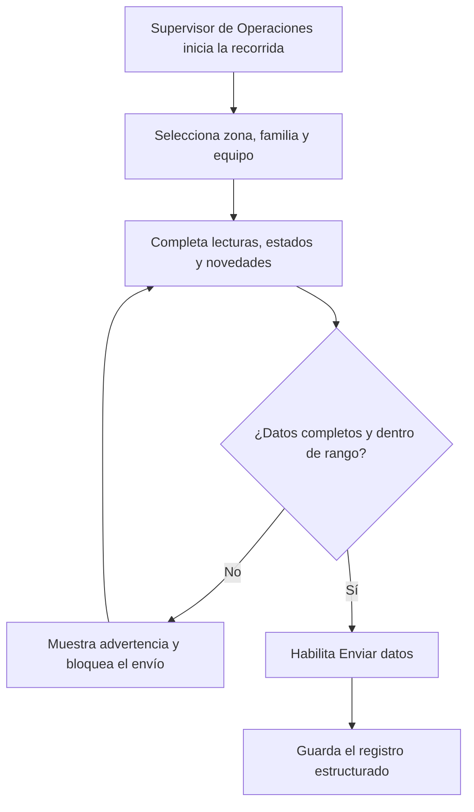
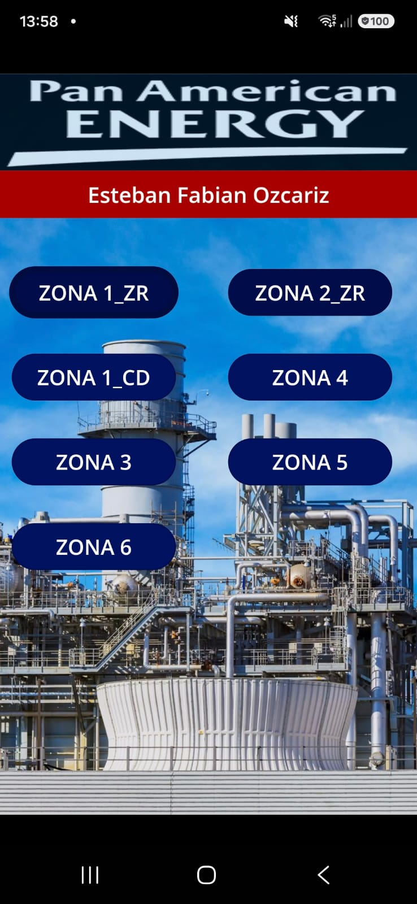
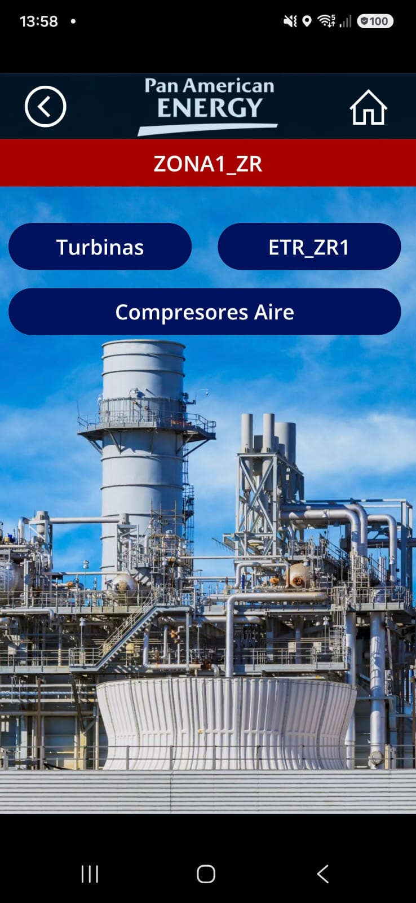
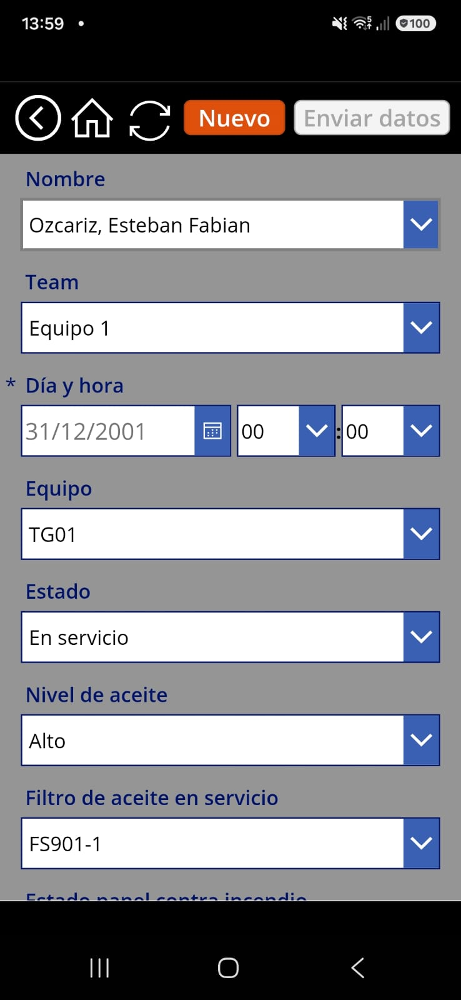
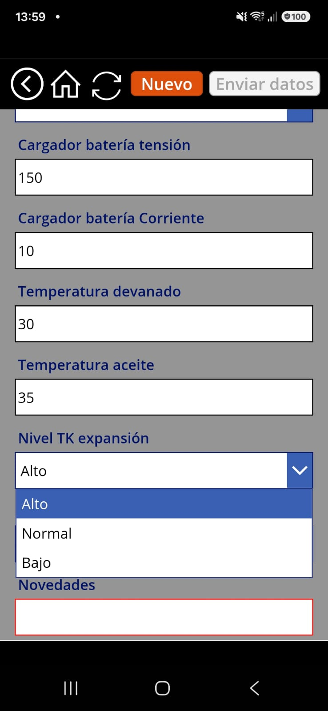
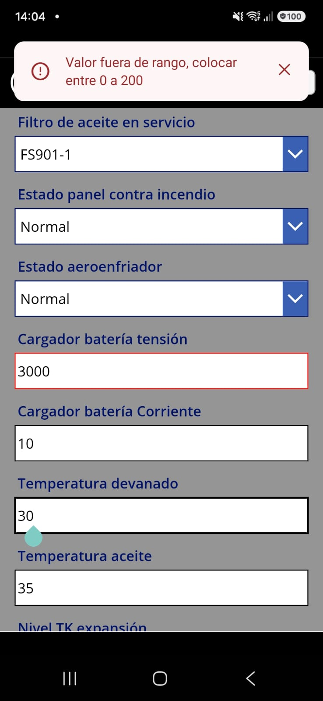
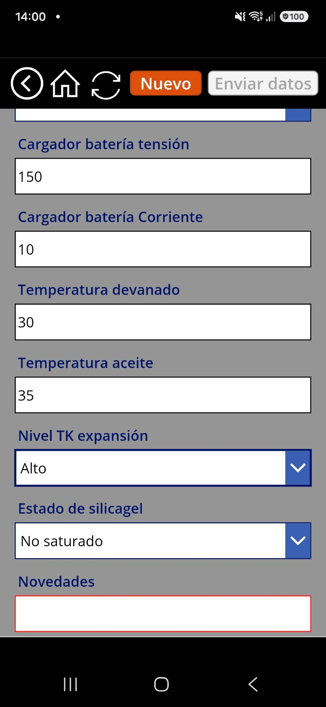
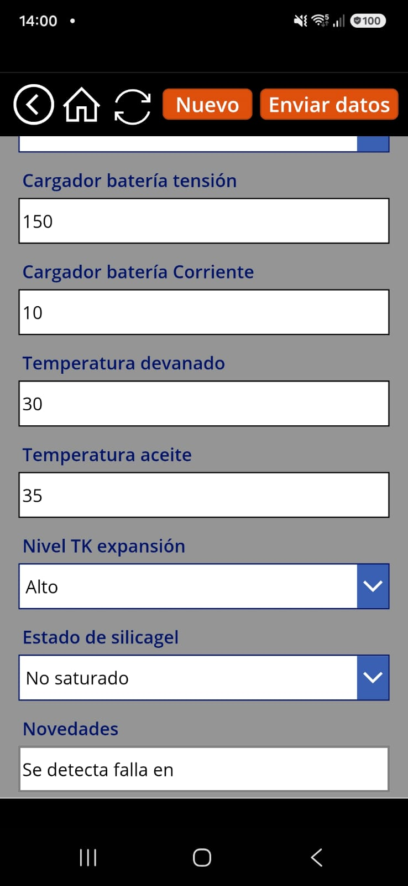
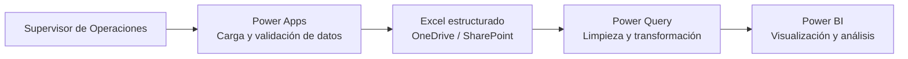

# Digitalización de Operaciones con Power Apps

Aplicación desarrollada en Microsoft Power Apps para digitalizar, estandarizar y centralizar la gestión de información de campo en ambas centrales de generación.

## Situación inicial

Antes del desarrollo de la aplicación, la información se recopilaba manualmente en planillas de papel y se almacenaba en carpetas físicas. Los registros no seguían una estructura estandarizada ni contaban con herramientas de visualización, lo que dificultaba su consulta, comparación y posterior análisis.

## Objetivo

Transformar las recorridas de campo en un proceso digital, permitiendo que los Supervisores de Operaciones registren la información directamente en el sitio del equipamiento y generando una base de datos estructurada para su posterior tratamiento y visualización.

## Alcance funcional

La aplicación comprende los equipos y sistemas de ambas centrales de generación, organizados por zonas y familias de activos.

Incluye, entre otros:

* Turbinas de generación.
* Transformadores y estaciones transformadoras.
* Compresores de aire.
* Cargadores de baterías.
* Bombas y sistemas de agua.
* Sistemas de alimentación y condensado.
* Sistemas auxiliares y de potencia.
* Registro de novedades detectadas durante las recorridas.

## Funcionalidades principales

* Navegación por zonas, sistemas y familias de equipos.
* Selección del equipo inspeccionado.
* Formularios específicos según el tipo de activo o proceso.
* Registro del Supervisor de Operaciones, equipo de trabajo, fecha, hora y observaciones.
* Estandarización de los datos operativos.
* Normalización de las lecturas tomadas en campo.
* Captura de información directamente en el sitio del equipamiento.
* Envío de datos mediante conexión móvil, sin depender de una infraestructura Wi-Fi local.
* Asignación automática de la fecha y hora actual, con posibilidad de modificación para cargas históricas.
* Campos y parámetros específicos para cada equipo.
* Validación de campos obligatorios y rangos numéricos.
* Notificaciones ante valores incorrectos o registros incompletos.
* Diseño para dispositivos móviles y adaptación progresiva para computadoras.
* Disponibilidad de la información para su transformación y visualización en Power BI.

## Flujo funcional de carga

## Capturas de la aplicación

### Navegación por zonas y equipos

<table>
<tr>
<td align="center">
 
<strong>Pantalla principal</strong> 
Acceso organizado a los equipos y sistemas de ambas centrales mediante zonas operativas.
</td>
<td align="center">
 
<strong>Navegación secundaria</strong> 
Selección de las familias de equipos correspondientes a cada zona.
</td>
</tr>
</table>

### Formulario y estandarización de datos

<table>
<tr>
<td align="center">
 
<strong>Formulario de carga</strong> 
Campos específicos para registrar las lecturas y condiciones de cada equipo.
</td>
<td align="center">
 
<strong>Estandarización de lecturas</strong> 
Opciones predefinidas para reducir diferencias de escritura y errores de carga.
</td>
</tr>
</table>

### Validaciones de calidad

<strong>Control de rangos numéricos</strong> 
Validación desarrollada con Power Fx para detectar lecturas fuera de los límites definidos antes de guardar la información.

### Control de campos obligatorios

<table>
<tr>
<td align="center">
 
<strong>Campo obligatorio pendiente</strong> 
El envío permanece bloqueado mientras falta completar información requerida.
</td>
<td align="center">
 
<strong>Formulario completo</strong> 
Al completar el campo Novedades, se habilita el envío del registro.
</td>
</tr>
</table>

## Arquitectura de la solución

Power Apps funciona como canal principal de captura. Los registros se almacenan en tablas estructuradas de Excel alojadas en el entorno corporativo de OneDrive/SharePoint. Posteriormente, Power Query transforma y consolida la información para su análisis en Power BI.

## Tecnologías utilizadas

* Microsoft Power Apps
* Power Fx
* Microsoft Excel
* Microsoft OneDrive
* Microsoft SharePoint
* Microsoft Power Query
* Microsoft Power BI

## Implementación técnica en Power Apps

* Aplicación Canvas organizada por zonas y procesos.
* Formularios de edición con DataCards para cada variable.
* Listas normalizadas de equipos, estados y condiciones.
* Validaciones desarrolladas con Power Fx.
* Control de rangos para tensiones, corrientes, temperaturas y otras lecturas.
* Bloqueo del envío cuando existen campos incompletos o valores fuera de rango.
* Mensajes de confirmación, error y actualización.
* Funciones de navegación, creación de registros, actualización y envío de formularios.
* Tratamiento de la fecha y hora local.
* Persistencia en tablas estructuradas utilizadas como fuentes de datos.
* Evolución desde un diseño móvil de ancho fijo hacia una interfaz adaptable.

## Impacto y beneficios

* Reducción considerable del tiempo requerido para tomar y registrar datos en campo.
* Eliminación del registro manual en planillas de papel.
* Estandarización de lecturas, estados y nombres de equipos.
* Mayor disponibilidad de la información para consulta y análisis.
* Posibilidad de identificar equipos inspeccionados, pendientes y con novedades.
* Creación de una fuente estructurada para tableros e indicadores.
* Implementación sin inversión adicional en software, aprovechando herramientas ya disponibles en la empresa.
* Alineación con el contexto de optimización y reducción de costos de la organización.

## Desafíos trabajados

* Digitalización de un proceso completamente manual.
* Organización de parámetros diferentes para cada familia de equipos.
* Normalización de nombres, estados y lecturas de campo.
* Prevención de registros incompletos, duplicados o fuera de rango.
* Corrección y tratamiento de la fecha y hora local.
* Incorporación de cargas correspondientes a días anteriores.
* Mantenimiento de la estructura de las tablas utilizadas como fuentes.
* Adaptación de una aplicación originalmente diseñada para teléfonos a un formato responsive.
* Conservación de la lógica de almacenamiento durante el rediseño visual.

## Evolución y mantenimiento

Durante la evolución de la aplicación se realizaron:

* Incorporación de nuevos equipos, campos y variables.
* Corrección de referencias y nombres de columnas.
* Ajustes para permitir la carga de datos históricos.
* Resolución de errores relacionados con registros existentes.
* Limpieza, organización y respaldo de las bases de datos.
* Administración de permisos de acceso.
* Revisión permanente de formularios y parámetros según las necesidades de campo.

## Mi rol en el proyecto

Mi participación comprende:

* Identificación de la necesidad operativa.
* Relevamiento del proceso manual existente.
* Definición y estandarización de los datos requeridos.
* Diseño y desarrollo de la aplicación en Power Apps.
* Creación de formularios, navegación y validaciones con Power Fx.
* Pruebas y ajustes con información real de campo.
* Mantenimiento y ampliación funcional de la aplicación.
* Diseño de la integración de los datos con Power Query y Power BI.
* Documentación de la solución y planificación de sus próximas etapas.

## Estado del proyecto

La aplicación se encuentra operativa y en proceso de mejora continua. La versión actual funciona principalmente en dispositivos móviles, mientras se desarrolla y valida progresivamente su adaptación para computadoras.

## Próximos pasos

* Completar la optimización responsive para computadoras.
* Validar el diseño adaptable desde dispositivos móviles y PC.
* Unificar formularios para simplificar la navegación y la carga.
* Incorporar nuevas validaciones y automatizaciones.
* Ampliar el catálogo de equipos y variables.
* Consolidar el almacenamiento en un espacio corporativo centralizado.
* Documentar la arquitectura y el flujo de datos.
* Incorporar capturas de las principales pantallas y funcionalidades.
* Preparar la información estructurada para futuras implementaciones de inteligencia artificial.
